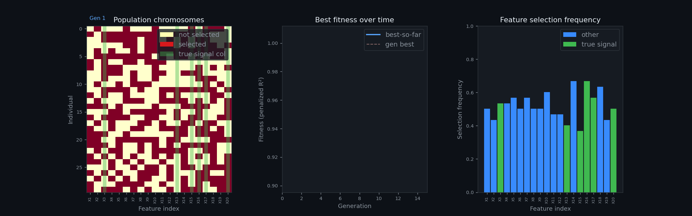

# GA: Genetic Algorithm for Variable Selection
GA-dev Team

-   [How It Works](#how-it-works)
-   [Installation](#installation)
    -   [Prerequisites](#prerequisites)
    -   [Install from Source](#install-from-source)
-   [Usage](#usage)
    -   [1. Python API](#python-api)
    -   [2. Command Line Interface (CLI)](#command-line-interface-cli)
    -   [CLI Help and Options](#cli-help-and-options)
    -   [Vectorization Benchmark](#vectorization-benchmark)
-   [Project Structure](#project-structure)
-   [Development](#development)
    -   [Running Tests](#running-tests)
    -   [Adding a New Fitness Strategy](#adding-a-new-fitness-strategy)
-   [Team Contributions](#team-contributions)
-   [AI Assistance](#ai-assistance)

A robust, flexible Python library for selecting the optimal subset of
features in regression and classification tasks using Genetic Algorithms
(GA).

This project automates feature selection, improving model performance
and interpretability by identifying the most relevant predictors.

## Demo



The animation shows the GA evolving over 15 generations on a synthetic regression dataset (200 samples, 20 features, 6 true signal features):

- **Left** — Population chromosomes: each row is an individual, each column a feature. Red = selected, yellow = not selected. Green bands mark the true informative features.
- **Center** — Best fitness (penalized R²) accumulated over generations (blue) and per-generation best (red dashed).
- **Right** — Feature selection frequency across the population. Green bars are true signal features; watch them rise as the GA learns.

To regenerate:

``` bash
python3 scripts/visualize_ga.py --output ga_animation.gif
```

## How It Works

-   Core Algorithm: Evolves binary feature masks via tournament
    selection; supports crossover (uniform/single/k-point) and mutation
    (bit-flip/swap), with elitism and optional adaptive mutation.
-   Fitness & Metrics: Cross-validated model score minus a sparsity
    penalty; regression uses a manual *R*<sup>2</sup> scorer
    (1 − SS<sub>*r**e**s*</sub>/SS<sub>*t**o**t*</sub>), classification
    supports accuracy, precision, recall, log-loss, and ROC-AUC.
-   Strategies: Pluggable fitness backends including Linear/Logistic
    Regression, Random Forest (reg/class), SVR/SVC, and Gradient
    Boosting; custom strategies via callables.
-   Data & CLI: Robust loaders for CSV/Excel/TXT, Pandas DataFrames,
    NumPy arrays, and Python lists; a friendly CLI to run GA end-to-end.
-   Parallelism & Reproducibility: Parallel CV via `n_workers`;
    deterministic options include fixed CV splits and seeded runs;
    integrates smoothly with scikit-learn datasets/models.

## Installation

### Prerequisites

-   Python \>= 3.10
-   Dependencies:
    -   numpy \>= 1.24
    -   pandas \>= 1.5
    -   scipy \>= 1.8
    -   scikit-learn \>= 1.2
    -   joblib \>= 1.2
    -   openpyxl \>= 3.0

### Install from Source

``` bash
git clone https://github.com/minikouda/GA.git
cd GA
pip install --user .
```

## Usage

### 1. Python API

The primary entry point is the `select` function.

``` python
from GA import select
from sklearn.datasets import load_diabetes

# Load regression data
X, y = load_diabetes(return_X_y=True)

# Run GA with linear regression R^2 fitness
result = select(
    X,
    y,
    penalty=0.01,
    n_gen=10,
    fitness_strategy="linear_regression",
    n_splits=3,
    n_workers=1,
    random_state=123,
)

print("Selected Feature Indices:", result['selected'])
print("CV Score (R2):", round(result['R2'], 4))
print("Penalized Fitness:", round(result['R2pen'], 4))
```

    Selected Feature Indices: [0 1 2 3 4 5 8 9]
    CV Score (R2): 0.5038
    Penalized Fitness: 0.4958

K points crossover:

``` python
result_sp = select(
    X,
    y,
    pop_size=30,
    n_gen=10,
    crossover_type="single_point",
    mutation_type="swap",
    fitness_strategy="linear_regression",
    n_splits=5,
    random_state=42,
)

print("Single-Point + Swap Result Indices:", result_sp['selected'])
print("CV Score (R2):", round(result_sp['R2'], 4))

result_kp = select(
    X,
    y,
    pop_size=30,
    n_gen=10,
    crossover_type="kpoints",
    k_points=3,
    adaptive_mutation=True,
    fitness_strategy="linear_regression",
    n_splits=5,
    random_state=42,
)

print("3-Point + Adaptive Result Indices:", result_kp['selected'])
print("CV Score (R2):", round(result_kp['R2'], 4))
```

    Single-Point + Swap Result Indices: [0 1 2 3 4 5 6 7 8]
    CV Score (R2): 0.4973
    3-Point + Adaptive Result Indices: [1 2 3 4 5 6 8]
    CV Score (R2): 0.508

### 2. Command Line Interface (CLI)

Below are several runnable CLI examples illustrating different **tasks,
fitness functions, and evaluation metrics**.  
All examples are intentionally small-scale for demo, testing, or CI
usage.

------------------------------------------------------------------------

> Note Random Forest strategies (regression/classification) can take
> longer due to tree ensembles and CV. For efficiency on multi-core
> machines, prefer `--n-workers -1` to use all cores.

Basic regression run (default diabetes dataset, MSE fitness):

``` python
%%bash
python3 scripts/run_ga.py \
  --pop-size 30 \
  --n-gen 10 \
  --n-splits 10 \
  --n-workers 1 \
  --random-state 42
```

    Using default 'diabetes' dataset from sklearn.
    GA Selection Result:
      Selected Features Indices: [0 1 2 3 4 5 6 7 8]
      Cross-validated Score (R2): 0.4860
      Penalized Fitness Score: 0.4860

Regularization

``` python
%%bash
python3 scripts/run_ga.py \
  --pop-size 30 \
  --n-gen 10 \
  --n-splits 10 \
  --n-workers 1 \
  --random-state 42 \
  --penalty 0.1
```

    Using default 'diabetes' dataset from sklearn.
    GA Selection Result:
      Selected Features Indices: [1 2 3 6 8]
      Cross-validated Score (R2): 0.4893
      Penalized Fitness Score: 0.4393

Classification with accuracy/recall metric (local CSV, last column =
target):

``` python
%%bash
python3 scripts/run_ga.py \
  --task-type classification \
  --metric accuracy \
  --n-gen 10 \
  --pop-size 15 \
  --n-splits 10 \
  --n-workers -1 \
  --data-path GA/data/sample_classification_data.csv \
  --random-state 42
```

    Loaded dataset from GA/data/sample_classification_data.csv with 30 samples and 6 features.
    GA Selection Result:
      Selected Features Indices: [0 3]
      Cross-validated Score (Accuracy): 0.5333
      Penalized Fitness Score: 0.5333

``` python
%%bash
python3 scripts/run_ga.py \
  --task-type classification \
  --metric recall \
  --fitness random_forest \
  --n-gen 5 \
  --pop-size 10 \
  --n-splits 5 \
  --n-workers -1 \
  --data-path GA/data/breast_cancer.csv \
  --random-state 42 \
  --penalty 0.1
```

    Loaded dataset from GA/data/breast_cancer.csv with 569 samples and 30 features.
    GA Selection Result:
      Selected Features Indices: [ 0  2  7 10 17 21 23 28]
      Cross-validated Score (Recall): 0.9611
      Penalized Fitness Score: 0.9344

### CLI Help and Options

You can see all available flags and defaults via `-h`:

``` python
%%bash
python3 scripts/run_ga.py -h
```

Common arguments:

<table>
<colgroup>
<col style="width: 25%" />
<col style="width: 25%" />
<col style="width: 25%" />
<col style="width: 25%" />
</colgroup>
<thead>
<tr>
<th>Argument</th>
<th>Type/Choices</th>
<th>Default</th>
<th>Description</th>
</tr>
</thead>
<tbody>
<tr>
<td><code>--fitness</code></td>
<td>string</td>
<td>—</td>
<td>Fitness strategy (e.g., <code>linear_regression</code>,
<code>logistic_regression</code>, <code>svr</code>).</td>
</tr>
<tr>
<td><code>--penalty</code></td>
<td>float</td>
<td>0.0</td>
<td>Sparsity penalty (higher selects fewer features).</td>
</tr>
<tr>
<td><code>--pop-size</code></td>
<td>int</td>
<td>50</td>
<td>Population size.</td>
</tr>
<tr>
<td><code>--n-gen</code></td>
<td>int</td>
<td>20</td>
<td>Number of generations.</td>
</tr>
<tr>
<td><code>--mutation-rate</code></td>
<td>float</td>
<td>0.01</td>
<td>Probability of mutation per gene.</td>
</tr>
<tr>
<td><code>--crossover-rate</code></td>
<td>float</td>
<td>0.8</td>
<td>Probability of crossover.</td>
</tr>
<tr>
<td><code>--crossover-type</code></td>
<td>uniform/single/kpoints</td>
<td>uniform</td>
<td>Crossover operator type.</td>
</tr>
<tr>
<td><code>--k-points</code></td>
<td>int</td>
<td>2</td>
<td>Cut points when <code>--crossover-type=kpoints</code>.</td>
</tr>
<tr>
<td><code>--n-splits</code></td>
<td>int</td>
<td>10</td>
<td>Number of CV folds.</td>
</tr>
<tr>
<td><code>--vectorized</code></td>
<td>flag</td>
<td>true</td>
<td>Enable vectorized selection operator.</td>
</tr>
<tr>
<td><code>--adaptive-mutation</code></td>
<td>flag</td>
<td>false</td>
<td>Toggle adaptive per-individual mutation rates.</td>
</tr>
<tr>
<td><code>--low-mutation-rate</code></td>
<td>float</td>
<td>—</td>
<td>Rate for fit individuals (requires
<code>--adaptive-mutation</code>).</td>
</tr>
<tr>
<td><code>--high-mutation-rate</code></td>
<td>float</td>
<td>—</td>
<td>Rate for unfit individuals (requires
<code>--adaptive-mutation</code>).</td>
</tr>
<tr>
<td><code>--patience</code></td>
<td>int</td>
<td>10</td>
<td>Early stopping patience (&lt;=0 disables).</td>
</tr>
<tr>
<td><code>--n-workers</code></td>
<td>int</td>
<td>1</td>
<td>CV parallelism (-1 uses all cores).</td>
</tr>
<tr>
<td><code>--data-path</code></td>
<td>path</td>
<td>—</td>
<td>Path to CSV/Excel/TXT; last column is target.</td>
</tr>
<tr>
<td><code>--task-type</code></td>
<td>classification/regression</td>
<td>—</td>
<td>If omitted, inferred from metric (default regression).</td>
</tr>
<tr>
<td><code>--metric</code></td>
<td>classification: accuracy/precision/recall/log_loss; regression:
r2/mae</td>
<td>—</td>
<td>CV scoring metric.</td>
</tr>
<tr>
<td><code>--random-state</code></td>
<td>int</td>
<td>—</td>
<td>Seed for reproducible GA and model randomness.</td>
</tr>
</tbody>
</table>

### Vectorization Benchmark

Run the benchmark comparing standard vs vectorized operators (smaller
size for quick demo):

``` python
%%bash
python3 scripts/bench_vectorized.py \
  --n-samples 300 \
  --n-features 80 \
  --pop-size 30 \
  --n-gen 8 \
  --n-splits 3 \
  --random-state 123
```

    === Benchmark results ===
    Data: n_samples=300, n_features=80
    GA: pop_size=30, n_gen=8, penalty=0.005
    Strategy: linear_regression; Crossover=kpoints (k=3); Mutation=swap; n_workers=-1
    -- Standard --
    Time: 8.55s | Score: 0.8457 | Penalized: 0.8434 | Selected 37
      Breakdown:
       - Evaluate (fitness/CV): 7.71s (90.1%)
       - Selection (tournament): 0.00s (0.0%)
       - Crossover: 0.00s (0.0%)
       - Mutation: 0.00s (0.0%)
       - Local refine: 0.84s (9.8%)
       - Generations run: 8
       - Cache: hits=0, misses=0 (hit rate 0.0%), unique subsets=227
    -- Vectorized --
    Time: 2.92s | Score: 0.8457 | Penalized: 0.8434 | Selected 37
      Breakdown:
       - Evaluate (fitness/CV): 2.09s (71.4%)
       - Selection (tournament): 0.00s (0.0%) [vectorized]
       - Crossover: 0.00s (0.0%)
       - Mutation: 0.00s (0.0%) (bit-flip is vectorized)
       - Local refine: 0.83s (28.6%)
       - Generations run: 8
       - Cache: hits=0, misses=0 (hit rate 0.0%), unique subsets=227
    Speedup (std/vec): 2.93x

## Project Structure

``` text
GA-dev/
├── GA/
│   ├── GA.py
│   ├── data_utils.py
│   ├── operators.py
│   └── fitness/
├── scripts/
│   ├── run_ga.py
│   ├── bench_vectorized.py
│   └── generate_test_data.py
├── pyproject.toml
├── README.md
└── README.qmd
```

## Development

### Running Tests

``` bash
pytest GA/tests/
```

### Adding a New Fitness Strategy

Extend `GA/fitness/strategies.py` and register in
`GA/fitness/registry.py`.

## Team Contributions

The project was a collaborative effort. Below is a summary of the
specific contributions and ownership for major components:

-   Data Loading & Preprocessing: robust file handling (CSV/Excel/TXT),
    normalization, `preprocess_data`. \[Xiaoyang Xiao\]
-   Genetic Algorithm Core: `GeneticSelector`, vectorized ops, adaptive
    mutation, early stopping, local refinement in GA/GA.py and
    GA/operators.py. \[Xinyue Wang\]
-   Fitness Strategies & Scoring: registry and strategies in GA/fitness
    including manual *R*<sup>2</sup>, MAE/MSE, ROC-AUC; fixed CV split
    and parameter hooks. \[Shizhe Zhang\]
-   CLI & Scripts: scripts/run_ga.py with strategy auto-resolution and
    hyphen flags; benchmarking/data scripts. \[Shizhe Zhang\]
-   Testing: unit/integration tests in GA/tests verifying numerical
    parity; \[Xiaoyang Xiao\]
-   Docs: README and Quarto docs maintenance.\[Xinyue Wang\]
